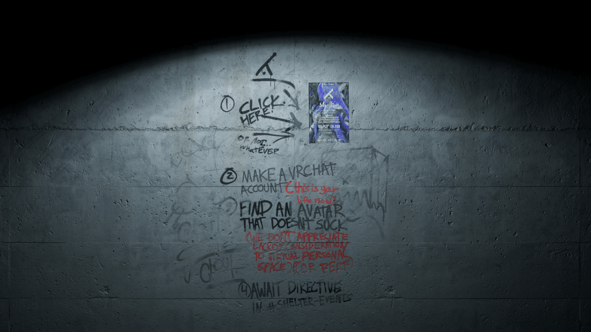

The old [SHELTERVR.CLUB](https://sheltervr.club/) website has been revamped for a lighter, faster, and more responsive experience. It's now accessible and features a pixel-perfect clickable area.

## Disclaimer

The images and icons in this repository are the property of SHELTER.CLUB and were solely used for demonstration purposes in this project, therefore exempt from the MIT license.

## Contributors

- [@ArthurSegato](https://github.com/ArthurSegato)
